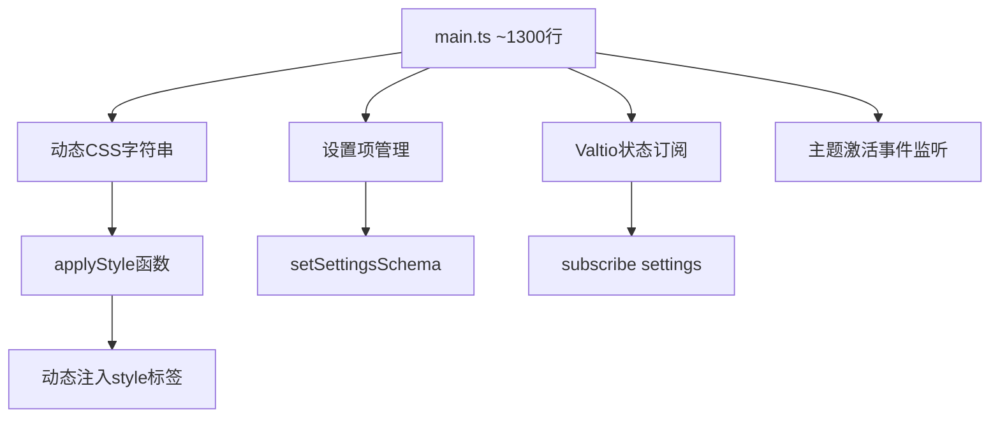
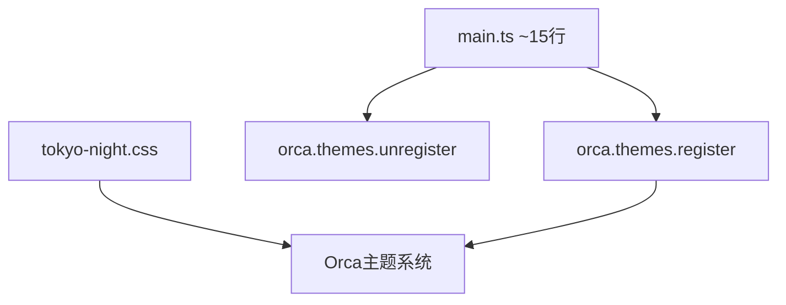

# 设计文档：Tokyo Night 主题简化重构

## 概述

本设计将 Tokyo Night 主题从复杂的 JavaScript 动态样式注入架构重构为官方推荐的纯静态 CSS 架构。重构后，所有主题样式将存放在单一的 CSS 文件中，插件入口代码将大幅简化，仅负责主题的注册和注销。

## 架构设计

### 当前架构（重构前）



### 目标架构（重构后）



## 组件与接口

### 1. 静态 CSS 文件 (`public/tokyo-night.css`)

负责定义所有 Tokyo Night 主题样式，包括：

- Tokyo Night 调色板变量定义
- Orca CSS 变量覆盖
- UI 组件样式（侧边栏、设置面板、按钮等）
- 内容样式（标题、列表、代码块等）

### 2. 插件入口 (`src/main.ts`)

根据官方文档，简化后的入口文件结构如下：

```typescript
let pluginName: string

export async function load(_name: string) {
  pluginName = _name
  orca.themes.register(pluginName, "Tokyo Night", "tokyo-night.css")
}

export async function unload() {
  orca.themes.unregister("Tokyo Night")
}
```

## 数据模型

### Tokyo Night 调色板

基于官方 Tokyo Night 配色方案：

| 变量名 | 颜色值 | 用途 |
|--------|--------|------|
| `--tokyo-night-bg-night` | `#1a1b26` | 主背景 |
| `--tokyo-night-bg-storm` | `#24283b` | 次背景/UI元素 |
| `--tokyo-night-bg-dark` | `#16161e` | 侧边栏背景 |
| `--tokyo-night-bg-float` | `#1f2335` | 浮动元素背景 |
| `--tokyo-night-foreground` | `#a9b1d6` | 主文字 |
| `--tokyo-night-white` | `#c0caf5` | 高亮文字 |
| `--tokyo-night-comment` | `#565f89` | 注释/次要文字 |
| `--tokyo-night-terminal-black` | `#414868` | 边框/分隔线 |
| `--tokyo-night-red` | `#f7768e` | H1/危险 |
| `--tokyo-night-orange` | `#ff9e64` | H2/警告 |
| `--tokyo-night-yellow` | `#e0af68` | H3 |
| `--tokyo-night-green` | `#9ece6a` | H4/成功 |
| `--tokyo-night-spring-green` | `#73daca` | 链接 |
| `--tokyo-night-cyan` | `#7dcfff` | 信息 |
| `--tokyo-night-blue` | `#7aa2f7` | H5/主强调色 |
| `--tokyo-night-magenta` | `#bb9af7` | H6 |

### Orca 变量映射

根据官方主题示例，需要覆盖以下 Orca 变量：

| Orca 变量 | Tokyo Night 映射 |
|-----------|------------------|
| `--orca-color-bg-1` | `--tokyo-night-bg-night` |
| `--orca-color-bg-2` | `--tokyo-night-bg-dark` |
| `--orca-color-text-1` | `--tokyo-night-foreground` |
| `--orca-color-text-2` | `--tokyo-night-comment` |
| `--orca-color-primary-5` | `--tokyo-night-blue` |
| `--orca-color-border` | `--tokyo-night-terminal-black` |
| `--orca-color-dangerous-5` | `--tokyo-night-red` |
| `--orca-color-selection` | 基于 primary-5 的半透明色 |


## 正确性属性

*正确性属性是系统在所有有效执行中都应保持为真的特征或行为——本质上是关于系统应该做什么的形式化陈述。属性是人类可读规范与机器可验证正确性保证之间的桥梁。*

### 属性 1：Tokyo Night 调色板完整性

*对于任何*有效的 Tokyo Night 主题 CSS 文件，它应当在 `:root` 选择器中定义所有 16 个核心 Tokyo Night 颜色变量。

**验证需求：1.2, 4.1**

### 属性 2：Orca 变量覆盖覆盖率

*对于任何*影响核心视觉外观的 Orca CSS 变量（背景、文字、主色、成功、警告、危险、信息、链接颜色），主题 CSS 应当提供映射到 Tokyo Night 颜色的覆盖。

**验证需求：1.3**

### 属性 3：标题颜色层次

*对于任何* H1 到 H6 的标题级别，主题 CSS 应当按照既定层次分配不同的 Tokyo Night 颜色（H1=红色, H2=橙色, H3=黄色, H4=绿色, H5=蓝色, H6=品红色）。

**验证需求：4.4**

## 错误处理

由于重构后的架构非常简单，错误处理主要依赖 Orca 的主题系统：

1. **CSS 文件加载失败**：Orca 主题系统会处理 CSS 文件加载错误
2. **主题注册失败**：`orca.themes.register()` 会在主题已存在时静默处理
3. **主题注销失败**：`orca.themes.unregister()` 会在主题不存在时静默处理

## 测试策略

### 单元测试

由于重构后的代码非常简单（约 15 行），主要测试集中在：

1. **CSS 文件验证**：验证 CSS 文件语法正确且包含所有必要的样式规则
2. **颜色变量完整性**：验证所有 Tokyo Night 颜色变量都已定义

### 属性测试

使用属性测试验证：

1. **调色板完整性**：所有 16 个核心颜色变量都存在
2. **Orca 变量覆盖**：所有关键 Orca 变量都有对应的覆盖
3. **标题颜色层次**：H1-H6 都有正确的颜色分配

### 手动测试

1. 在 Orca Notes 中启用主题，验证视觉效果
2. 切换主题，验证样式正确移除
3. 重新加载插件，验证主题正常工作

## 文件变更摘要

### 开发时的项目结构

```
tokyo-night-orca-theme/
├── public/
│   └── tokyo-night.css      # 主题样式文件
├── src/
│   ├── main.ts              # 简化后的入口文件（约 15 行）
│   ├── orca.d.ts            # Orca API 类型定义
│   └── vite-env.d.ts        # Vite 环境类型
├── icon.png
├── package.json
├── tsconfig.json
├── tsconfig.node.json
├── vite.config.ts
├── README.md
├── LICENSE
└── CHANGELOG.md
```

### 部署后的插件结构

```
tokyo-night-orca-theme/      # 放入 Orca plugins 目录
├── dist/
│   └── index.js             # 编译后的插件代码
├── tokyo-night.css          # 主题 CSS 文件
└── icon.png                 # 插件图标
```

### 删除的文件/目录

- `src/translations/` - 整个目录（不再需要翻译）
- `src/libs/` - 整个目录（不再需要 l10n 库）
- `src/css/` - 空目录

### 修改的文件

- `src/main.ts` - 从约 1300 行简化为约 15 行
- `public/theme.css` → `public/tokyo-night.css` - 重命名并整合所有样式
