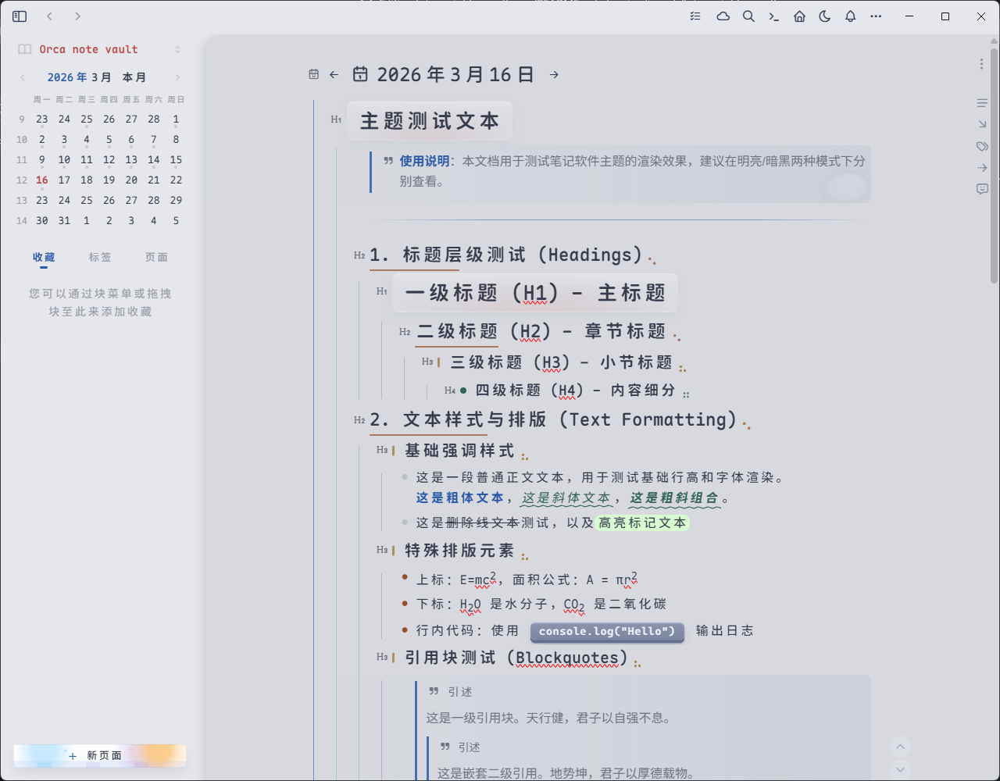
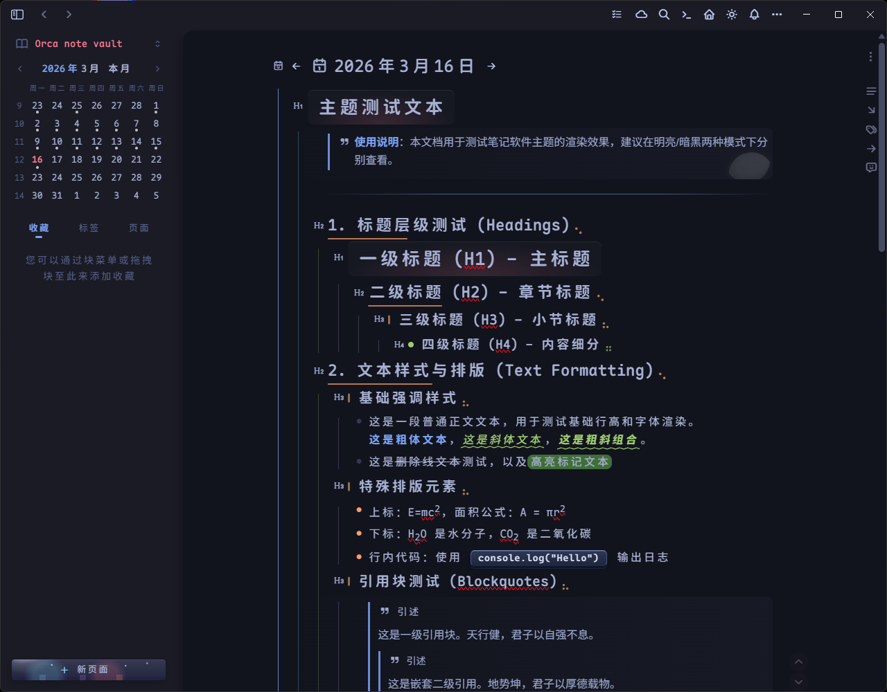

# Tokyo Night 主题 for Orca Notes

适用于 [Orca Notes](https://www.orca-studio.com/orcanote/zh/) 的 Tokyo Night 双模主题，支持 Light / Dark 自动切换，并对编辑区、侧边栏、设置页和白板场景做了系统化视觉统一。

##  预览

### 亮色模式


### 暗色模式


##  功能与特性

- Tokyo Night Light / Dark 双模自动切换（跟随系统或 Orca 亮暗模式）。
- 全局 UI 风格覆盖：侧边栏、菜单弹层、设置页、主编辑区、工具栏。
- Excalidraw 白板专项主题：工具区、侧栏、弹层、菜单、库切换器等区域统一视觉语言。
- 查询条件框霓虹动态效果：多光源渐变与流动背景，含 `prefers-reduced-motion` 降级支持。
- 代码高亮体系对齐 Tokyo Night：覆盖预览态与编辑态（CodeMirror）语义色映射。
- 行内代码 keycap 质感与按压反馈，提升可读性和交互一致性。
- Callout 样式增强：支持多类型提示块的差异化配色与视觉反馈。
- 侧边栏日历、标签、图标与交互反馈统一，优化亮/暗模式下可见度与层级感。

## 特色样式

- Tokyo Night 语义化变量体系：颜色、阴影、圆角、层级线统一管理。
- 主编辑区与窗体融合设计：增强层次但避免割裂感，兼顾沉浸与清晰边界。
- 细节过渡优化：hover/focus/active 状态平滑衔接，减少视觉抖动。
- 列表、标题、块层级线分级着色，强化信息结构辨识度。
- 代码块行号、gutter、语法 token 与背景协同，提升长文档阅读与扫描体验。

## 安装

1. 前往 [Releases](https://github.com/lioyeah/tokyo-night-orca-theme/releases) 下载最新发行包。
2. 解压后将插件目录放入 Orca Notes 插件目录：
   - Windows: `C:\Users\<用户名>\AppData\Roaming\Orca\plugins`
   - macOS: `/Users/<用户名>/Library/Application Support/Orca/plugins`
   - Linux: `~/.config/Orca/plugins`
3. 重启 Orca Notes，在 `设置 -> 外观 -> 主题` 选择 `Tokyo Night`。

## 开发与构建

```bash
npm install
npm run build:css
npm run dev
npm run build
npm run lint:css
```

- 主题源码按模块拆分在 `src/theme-css/`，由 `manifest.json` 定义拼接顺序。
- `npm run build:css` 生成 `public/tokyo-night.css`。
- `npm run build` 在构建后通过 `postbuild` 自动同步到 `dist/tokyo-night.css`。
- `npm run check` 可执行完整检查（构建 + CSS 规则检查）。

## 致谢

本主题的设计与实现受到以下项目启发，特此感谢：

- [tokyo-night-visual-studio-theme](https://github.com/m1chaelbarry/tokyo-night-visual-studio-theme)
- [typora-theme-phycat](https://github.com/sumruler/typora-theme-phycat)

## 许可证

[MIT](LICENSE)
